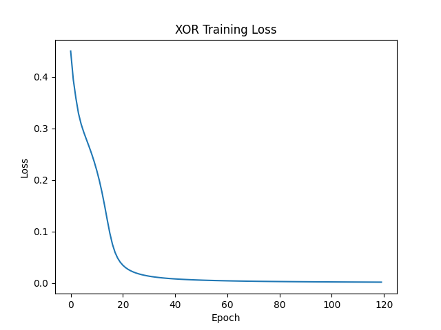
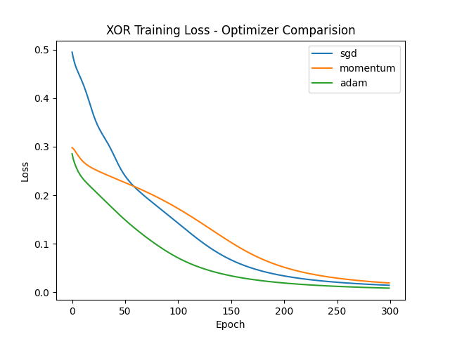
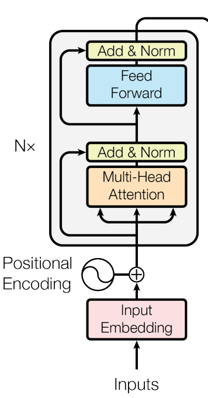

# ML Foundations

Building ML from scratch - no shortcuts, no black boxes.

---

## Day 1 - Matrix Multiplication from Scratch

Implemented matrix multiplication using nested loops in pure Python with no NumPy.
Includes dimension mismatch validation.

**Key Concepts**
- How matrix multiplication actually works under the hood.
- Every deep learning operation is matrix multiplication at its core.

**Files:** `matrix_operations.py`

---

## Day 2 - Numerical Gradients

Computed numerical gradient of f(x)=x² and f(x,y)=x²+y² using the definition (f(x+h)-f(x))/h.
Verified chain rule by hand.

**Key concepts:**
- A derivative is just the slope at a point.
- Gradients are how neural networks know which direction to update.

**Files:** `gradient.py`

---

## Day 3 - Loss Functions from Scratch

Implemented MSE, Binary Cross-Entropy, and Categorical Cross-Entropy in NumPy without any ML libraries.

**Key Concepts**
- Cross entropy derived from information theory.
- Loss is just -log(probability assigned to correct class).
- BCE punishes confident wrong answers far harder than MSE.
- Numerical stability via np.clip to prevent log(0).

**Files:** `loss_function.py`

---

## Day 4 - Value Class from Scratch (Andrej Karpathy)

Implemented __add__, __mul__, backward() and tanh() from ground up.

**Key Concepts**
- Autograd tracks every operation in a computation graph so gradients can flow backwards automatically
- The chain rule is how gradients move through the graph - each operation multiplies the incoming gradient by its local derivative
- Topological sort ensures gradients are computed in the right order - output before inputs
- Leaf nodes (like `a` and `b`) accumulate gradients via `+=` because they can be used in multiple operations
- tanh saturates for large inputs - gradient approaches 0, which is why weight initialization matters

**Files:** `micrograd.py`

---

## Day 5 - Built 2-Layer neural network in pure NumPy.

Implemented init_params, sigmoid, forward, compute_loss, backward, update_params, training functions.

**Key Concepts**
- `init_params` - Initializes random weights. 
- `sigmoid` - A function for sigmoid activation.
- `forward` - The forward functionality of the network.
- `compute_loss` - Loss computation
- `backward` - Backpropagation.
- `update_params` - Optimizer that updates the current weights to minimize loss.
- `train` - The function that encapsulates everything we built so far and trains the neural network.

XOR Results table -

| Input | Target | Predicted |
|-------|--------|-----------|
| [0,0] | 0      | 0.0301    |
| [0,1] | 1      | 0.9369    |
| [1,0] | 1      | 0.9491    |
| [1,1] | 0      | 0.0613    |

**Key Insight:** A linear model cannot solve XOR. The hidden layer learns an intermediate representation that makes XOR linearly separable, that's why depth matters.

Loss curve image - 



**Files:** `neural_net.py`

---

## Day 6 - Optimizers from scratch.

Implemented three optimizers and compared their convergence on XOR.

**Key Concepts**
- SGD: The simplest update: `w = w - lr * g`. Works but oscillates in ravines and can be slow through flat regions.
- Momentum: Adds a velocity term that accumulates past gradients, smoothing out noise and accelerating through consistent gradient directions, like a ball rolling downhill.
- Adam: Combines momentum (first moment) with RMSProp (second moment) to give each parameter its own adaptive learning rate. Bias correction fixes the zero-initialization bias in early steps.
    - Adam needs a lower `lr=0.01` vs `0.1` for SGD/Momentum because its adaptive scaling already amplifies small gradients.

**Key Insight:** Adam adapts learning rate per weight using momentum + velocity. On XOR it converges fastest.

Loss curves show the tradeoff: SGD is most erratic, Momentum is smoother and Adam is fastest and most stable.



**Files:** `neural_net.py`

---

## Day 8 - Scaled Dot-Product Attention from Scratch

Implementation of softmax and scaled dot-product from 'Attention Is All You Need 2017'

**Key Concepts**
- Q, K, V - what actually they are?
    - They come from the same input sequence, just projected through three different learned weight matrices (Wq, Wk, Wv). So if your input is X:

        - Q = X·Wq
        - K = X·Wk
        - V = X·Wv
    
    The real question is - _why three separate projections?_ Here's the intuition:

    Think of it like a search engine. **Q is your search query. K is the index of every document**. You compute QKᵀ to ask: _how relevant is each document to my query?_ That gives you attention scores. **Then V is the actual content** of each document. You use the scores to take a weighted sum of V - so you retrieve content proportional to relevance.

- **Why √dₖ matters?** When dₖ is large, the dot products Q·K get very large in magnitude. Large values push softmax into regions where its gradient is nearly zero. The softmax saturates and learning stalls. Dividing by √dₖ keeps the values in a reasonable range before softmax.

- **Positional Encoding** It adds a vector to each token's embedding to tell the model where that token sits in the sequence. Sine and cosine are used because they stay between -1 and 1 (avoiding large number bias) and different frequencies across dimensions ensure every position gets a unique pattern the model can distinguish.

**Files:** `attention.py`

---

## Day 9 - Transformer Encoder from Scratch

Implemented the complete Encoder Module from 'Attention Is All You Need 2017' in Pytorch.

**Key Concepts**

- **Multi-Head Attention:** Instead of performing a single attention function with dimension keys dmodel, it is beneficial to linearly project the queries, keys and values h times with different, learned linear projections to dq, dk and dv. We perform the attention function parallel on each of these projected versions, yielding dv-dimensional output values. These are concatenated and again projected, resulting in the final values.

- **Feed Forward:** In Transformer specifically two linear projections with a ReLU in between.
    Input(d_model) -> Linear -> ReLU -> Linear -> Output(d_model)

    where the d_model = 512 and dff = 2048

- **Residual Connections:** 
    - **Add:** After passing through a sub-layer (like MultiHead Attention) you add the original input back to the output `x = x + sublayer(x).` This ensures that even if the sub-layer learns nothing useful, the original information is never lost.

    - **Norm:** Immediately after the Add, you normalize the values to keep them well-behaved and stable so training doesn't go haywire. 

    Together: `output = LayerNorm(x + sublayer(x))`

- **Encoder Block:** Brings together the MultiHead Attention, Feed Forward and the Residual Connections 

**Key Insight:** The Encoder doesn't generate anything new, it just builds a richer, context-aware representation of the input. Each token's embedding gets updated to reflect not just _what_ it is, but _how it relates to every other token_ in the sequence

Output shape verified:
```python
model = Transformer(vocab_size=1000)
x = torch.randint(0, 1000, (2, 10))
out = model(x)
print(out.shape)  # torch.Size([2, 10, 512])
```



**Files:** `transformer.py`